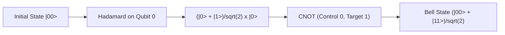

# Quantum Statevector Circuit Simulator Skill

High-efficiency, zero-dependency Python implementation of a **Full Complex Statevector Quantum Circuit Simulator**.

## Features
- **Unitary Gate Evolution**: Simulates Hadamard, CNOT, Pauli, and Phase operations via complex vector tensor updates.
- **Entanglement Verification**: Synthesizes maximally entangled Bell and GHZ states.
- **Zero External Dependencies**: Pure Python standard library (`math`, `cmath`).
- **Native MCP Protocol**: JSON-RPC 2.0 stdio server compatible with Claude Desktop, Cursor, and Windsurf.

## Architecture

